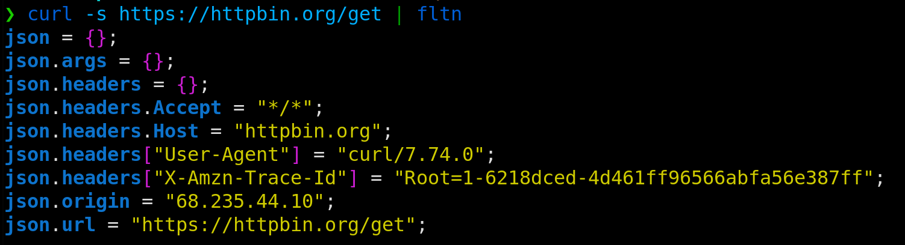

# Flatten

[](https://crates.io/crates/fltn)
[](https://github.com/nickjer/fltn/releases)
[](https://github.com/nickjer/fltn)
[](https://github.com/nickjer/fltn/actions)

A command line interface (CLI) used to flatten a serialized data structure
(e.g, CSV, JSON, TOML, YAML) making it greppable.



Inspired heavily by the amazing [gron] CLI.

[gron]: https://github.com/tomnomnom/gron

## Installation

Install using [cargo]:

```shell
cargo install fltn
```

## Pre-compiled Binaries

An alternative method is to download and run the pre-compiled binaries:

https://github.com/nickjer/fltn/releases
