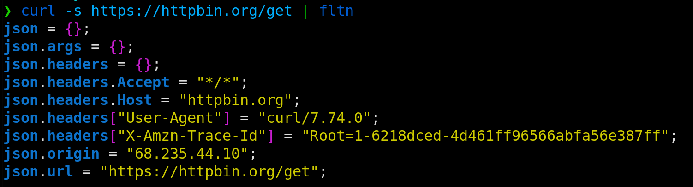

# Flatten

[](https://crates.io/crates/fltn)
[](https://github.com/nickjer/fltn/releases)
[](https://github.com/nickjer/fltn)
[](https://github.com/nickjer/fltn/actions)

A command line interface (CLI) used to flatten a serialized data structure
(e.g., CSV, JSON, TOML, YAML) making it greppable.



Inspired heavily by the amazing [gron] CLI.

[gron]: https://github.com/tomnomnom/gron

## Installation

### Pre-compiled Binaries

You can download and run the [pre-compiled binaries] to get up and running
immediately.

[pre-compiled binaries]: https://github.com/nickjer/fltn/releases

### Cargo

Alternatively, install using [cargo]:

```shell
cargo install fltn
```

[cargo]: https://doc.rust-lang.org/cargo/

## Usage

```
fltn [OPTIONS] [FILE]

Arguments:
  [FILE]  The serialized data file to be parsed

Options:
  -p, --path <PATH>      JSONPath expression used for querying data
  -f, --format <FORMAT>  Format of serialized data [possible values: csv, json, toml, yaml]
  -c, --color <WHEN>     When to use colors [default: auto] [possible values: never, auto, always]
  -s, --sort             Sort output
  -h, --help             Print help
  -V, --version          Print version
```

### Basic Example

Flatten a JSON file:

```shell
$ fltn data.json
```

Or pipe data through stdin:

```shell
$ echo '{"name": "Alice", "age": 30, "active": true}' | fltn
json = {};
json.name = "Alice";
json.age = 30;
json.active = true;
```

### Nested Structures

Nested objects and arrays are flattened into dot notation and bracket notation:

```shell
$ cat data.json
{"users": [{"name": "Alice", "role": "admin"}, {"name": "Bob", "role": "user"}]}

$ fltn data.json
json = {};
json.users = [];
json.users[0] = {};
json.users[0].name = "Alice";
json.users[0].role = "admin";
json.users[1] = {};
json.users[1].name = "Bob";
json.users[1].role = "user";
```

### Grep for Values

The flattened output makes it easy to grep for specific values:

```shell
$ fltn data.json | grep admin
json.users[0].role = "admin";
```

### JSONPath Filtering

Use JSONPath expressions to filter the data before flattening:

```shell
$ fltn --path '$.users[*].name' data.json
json = [];
json[0] = "Alice";
json[1] = "Bob";
```

### Sorted Output

Sort object keys alphabetically with the `--sort` flag:

```shell
$ echo '{"zebra": 1, "apple": 2, "mango": 3}' | fltn --sort
json = {};
json.apple = 2;
json.mango = 3;
json.zebra = 1;
```

### Multiple Formats

The format is auto-detected from the file extension, or can be specified with
`--format`:

**CSV:**

```shell
$ cat data.csv
name,age,city
Alice,30,NYC
Bob,25,LA

$ fltn data.csv
json = [];
json[0] = {};
json[0].name = "Alice";
json[0].age = "30";
json[0].city = "NYC";
json[1] = {};
json[1].name = "Bob";
json[1].age = "25";
json[1].city = "LA";
```

**YAML:**

```shell
$ cat config.yaml
name: Alice
settings:
  theme: dark
  notifications: true

$ fltn config.yaml
json = {};
json.name = "Alice";
json.settings = {};
json.settings.theme = "dark";
json.settings.notifications = true;
```

**TOML:**

```shell
$ cat config.toml
[server]
host = "localhost"
port = 8080

$ fltn config.toml
json = {};
json.server = {};
json.server.host = "localhost";
json.server.port = 8080;
```
